# 
VTM SMT Warehouse Operation Guidelines

```mermaid
flowchart LR
    A[MC place SO#] --> B[PMC place schedule]
    B --> C[SMT warehouse download SO from SAP]
    C --> D[import list into WMS system]
    D --> E[WMS system check material availability]
    E -->|complete:Y| F[issue materials to production line]
    E -->|incomplete:N| G[follow system's missing material list to procure]
    F --> H[prepare for production]
    G --> H
    H --> I[BOM change detected]
    I -->|Y| J[adjust usage up/P/N]
    I -->|Y| K[reduce usage P/N]
    J -->|Y| L[roll single method for material issuance]
    L --> M[production start]
    K --> M[production start]
    M --> N[insufficient batch closure due to throwing errors?]
    N -->|Y| O[work order anomaly with material issuance]
    N -->|N| P[close work order]
    O --> P[close work order]
    P --> Q[return defective materials X-RAY points, label them]
    Q --> R[smart shelf for returned materials]
    R --> S[system generates return deviation]
    S --> T[production line confirms deviation]
    T --> U[open MR ticket]
```

## SMT Smart Shelf Operation Guide
### 1. Receiving and Storing Materials
#### 1.1 Download QP00 PASS Data List from SAP.
* **SAP** Download QP00 Data
    - Enter transaction code `MB52`
    - Input "5501" in "Plant" and "QP00" in "Storage Location" fields
    - Click the clock icon 🕥 or press `F8` to execute
    - Download document as Excel>Print>Receive and Store. 
    - 
    
* **Notes** Download QP00 Data
    - Open Notes
    - Click `SBU5-VTM IQC Inspection Document`
    - Click `Gen Report`
    - Click `4.Store Pass Report` then click Ok.
    - Organize the table then print material issue information. 
    - 
    - 
    
* > **Tip**: Downloaded data needs to be sorted in sequential order. The quantity and batch of QP00 data received must match the system or list exactly, otherwise immediately report to receiving department and handle exception immediately.

#### 1.2 QP00 Data Storage into SAP System and Smart Shelf Placement.
* 1. QP00 Data Storage into SAP System (Large reels smart shelf location is `SB00`, small reels smart shelf location is `SA00`)
    * Open WMS system, enter username and password to login (server address is: `172.28.30.35:8085`)
    * 
    * Select menu `11-Move Loc`
    * 
    * Scan the `Batch` barcode on the material
    * Scan shelf location, large reels smart shelf location is `SB00`, small reels smart shelf location is `SA00`
    * Verify scanned quantity and scanning storage location
    * Click save 
    * 
    
* 2. After completing QP00 PDA WMS system storage, start storing data into smart shelf.
    * First ensure PDA has switched to smart shelf dedicated WIFI. (Name: `ESTECH-DEVELOP-HW`, Password: `EST666666`)
    * 
    * Open PDA, enter address `192.168.5.4:9069` in browser, this is the smart shelf service address.
    * Enter your ID and password, then login.
    * 
    * Click the top left menu icon
    * 
    * Select the second menu in order, named `Operation Menu`
    * 
    * Then select the first menu, named `Material Storage`
    * 
    * Then bring goods to smart shelf, scan the first barcode on left and right sides of shelf from top to bottom, named `Storage Mode`
    * Then scan the QR code of the material. After scanning, check if the color prompted by PDA is green, if so you can place the material on smart shelf
    * > The scanned barcode can only be VTECH QR code, not other barcodes. And the scanned reel of material, then only that reel can be placed on smart shelf, and only allows `same smart shelf A or B side, can only have simultaneous single operation work. No multiple people operations.`

### 2. Smart Shelf Material Issue

#### 2.1 Data Preparation
* Download material issue documents
    * First download required work order data from `Smart Factory`, address is: `http://172.28.30.23/sbu5`
    * Enter username and password
    * 
    * Select `Warehouse Management`
    * Select `SO3 Warehouse Preparation PrePare`
    * 
    * Enter work order number, then press **Enter key**
    * Click page `Export` to export excel data 
    * 
#### 2.2 Smart Shelf Material Issue
* Data upload, material issue.
    * Computer first switch to smart shelf dedicated WIFI
    * Open browser enter `http://192.168.5.4:9069/web/login`, enter system.
    * Enter username and password to login.
    * 
    * On default page interface select `View`, if cannot find, can click menu page select `Inventory`
    * 
    * In inventory `Preparation Operation` interface, click **New**
    * 
    * In `New` page, scroll mouse to middle area, select **Production Order**
    * In **Production Order** selection below, click `Add Detail Lines`.
    * 
    * Then select the bottom of opened interface in order, fourth button **Bulk Upload**
    * 
    * In upload interface, select button `Upload Your File`
    * Then click `Confirm Upload`
    * 
    * Return to `Add Detail Lines` opened interface, select just uploaded order number.
    * Then click the bottom of opened interface `Select` button.
    * 
    * After selection, will return to `Preparation Operation` interface, in menu bar below **New** next to click `Save` button. Save this document
    * 
    * After saving document, will generate similar `PICK-01611` document number.
    * 
    * Then scroll to middle of page, click `Check Inventory`
    * 
    * Then select button `Light Up for Outbound`, select light color. Then click `Bulk Outbound`.
    * 
    * 
    * According to smart shelf main light **light color prompt** (`Green` for normal shelf, `Yellow` for operation needed shelf, `Red` for abnormal shelf), select `Yellow` smart shelf. Take the materials to be outbound to designated area. And attach identification tag. (**Necessary information on identification tag**: Work Order Number, Customer, Model, Sets)
    * Finally to confirm if outbound completed, need to click `Check Inventory` again, ensure all materials that can be outbound are fully outbound.
    * After re-operation, click `Check Inventory` again, if system has no reaction, means all material outbound completed. Cannot light up again.
    
#### 2.3 Shortage Data Download Verification and Send to PMC
* Check preparation operation status
    * Select under `Requirement` menu, title column `Shortage Quantity` sorted from largest to smallest, or click `Requirement Download`
    * 
    * Filter **Shortage Quantity** greater than 0 data, these are current work order shortage data.
    * 
    * Shortage data will be divided into two situations.
        * Materials not on smart shelf but actually have stock. Re-issue materials.
            1. Bind operation
                1. Find actual materials needed for issuance, need to be greater than **shortage quantity** of actual quantity.
                2. On mobile device, select `Bind Operation` in `Operation Menu`
                2. Select current operation system number `PICK-` prefixed number. Can refer to `Production Order` selection. Or search input `Order Number or PICK Number`.
                - 
                3. Then scan required material QR code.
                - 
            2. Directly put shortage data back on smart shelf again, then `Check Inventory` select `Bulk Outbound` again.
        * After confirming no actual materials, need to organize a shortage list.
     * After confirming actual shortage, then send list to PMC, let PMC follow up shortage data.
     
> Notes
> All materials with shortage in work orders, regularly track Follow-up materials.
> Specific operation, enter Follow-up material work order `Preparation Operation` interface, click `Check Inventory`, if there is data, click `Bulk Outbound`, continue issuing materials to current work order.
            
#### 2.4 Work Order Modification
1. Work order material modification, quantity modification **Note: Need to modify according to PMC's Notes `P0C` specified information**
    - In `Preparation Operation` interface, select required `Production Order`, click.
    - 
    - Then select detail in title `Requirements`.
    - 
    - Can add material number, modify quantity, increase or decrease. But cannot **delete any material numbers, modify to 0 is acceptable**
    - 
   
2. Work order materials already issued, cancel work order
    - In `Preparation Operation` interface, select required `Production Order`, click.
    - Modify all material quantities inside to **0**.
    - 
    > Tip: If work order not yet issued materials, need to cancel intermediate work order, then remake material issue data, re-upload.

### 3. Return Materials, Counting, Place on Smart Shelf

#### 3.1 Counting
* When current work order, production department completes production, return materials to warehouse.
    1. Through counting machine counting, put material reels into counting machine, then press button to start
    2. Remove reel, will automatically print label.
    3. Cover label over original QR code location.
    - X-RAY counting machine initialization operation **If any problems, can try initialization, can solve 90% of problems**
        - Press physical button `RESET`
        - Click X-RAY software `Init`, initialize.
        > Note: X-RAY login username and password both lowercase `admin`
#### 3.2 Storage    
* After counting completed, single operator handles return material storage.
1. Open corresponding work order `Preparation Operation` interface.
2. Click top left corner `Create Return Material Form`
- 
3. Interface will show a QR code appear
- 
4. Operating staff, on PDA select `Operation Menu` then select `Return Material Storage`
5. First scan `Preparation Operation` interface `Return Material QR Code`
- 
6. Then scan QR code on material, same as normal material storage, until scanning storage completed.
### 4. Calculate Loss and Create MR Form
#### 4.1 After Return Material Storage Completed
1. Open corresponding work order `Preparation Operation` interface.
2. Click top left corner `Calculate Loss`.
3. Software scroll mouse to middle, click `Loss Download`.
- 
4. Organize downloaded table, filter table `H` column, or column named `Loss Quantity` greater than 0 data.
5. Extract `Material Number` column and `Loss` column separately, this is loss data.
- 

#### 4.2 Create MR Form
* **Notes System**
    - Open `SBU5-VTM MR & RN` system
    - 
    - Click button `New MR`
    - `Select Type` choose `Departmental Drawing` then click `OK` button
    - 
    - Select `Reason Code` choose `LE` code.
    - Select department `PROD`
    - Enter production line number
    - In `Customer` enter corresponding customer code
    - In `Remake` enter remarks
    - In `PN` and `Qty` enter material number and quantity
    - If too many can use toolbar `Import` to import required data only need fill material number and quantity in table
    - After above steps completed initiate approval wait related leaders approve then use SAP
    - 
    

**Common MR Form `Reason Code`** Approval person is corresponding department head (all RN Type do not select)

| Serial No. | Code | Department | Production Line |                            Remarks                            |
| ---- | ---- | ---- | -------- | --------------------------------------------------------- |
| 1    | SA   | Warehouse |          | Warehouse adjustment, periodic inventory discrepancy, shared material balancing                          |
| 2    | SA   | Production |          | PROD DISCREPANCY + B9821201680 Production discrepancy + discrepancy form number        |
| 3    | LB   | Warehouse |          | Used for packing 43LED lights                                            |
| 4    | LB   | SMT  | 1035     | 012986,012247,012082,011530,k10098,KLA881,KOA879 extra board return warehouse |
| 5    | LE   | SMT  | 1001     | 8/7/2024 SMD machine shared material balancing                                 |
| 6    | GF   | PMC  |          | No demand materials, disposal processing.                                       |
| 7    | G0   | PMC  |          | Sent for customs inspection, batteries cannot be used before test report issued.                       |
| 8    | G3   | PMC  |          | Outsourced test samples balancing, outsourced test samples balancing, outsourced loss samples                       |

### 5. Supply Materials
* Exist work orders during production department operations, need continued accumulation or no return material operations.
    1. Find original work order
    - 
    2. Repeat **2.1** Smart shelf material issue action, only need add work order to original work order

### 6. Cut Materials
- If one material is needed by two different work orders.
    1. In smart shelf system menu select `Inventory`, then select `Material Traceability`
    2. Query which work order material is used by.
    3. Find used materials
    4. On PDA `Operation Menu` `Split Unbind` interface unbind, scan material QR code.
    - 
    5. Cut materials to meet different work order quantities, must be greater than required quantity.
    6. Then print two labels respectively. Through `Bind Operation`, bind materials to these two work orders.
    - 

### 7. Other Operations
#### 7.1 Smart Shelf Inventory Inquiry
- Can query inventory information of materials contained in smart shelf
    1. Login system
    2. Select menu `Inventory`, then select menu bar `Raw Materials` enter inventory inquiry interface.
    - 
    - 
    3. Search required data in input box, need search by conditions. Select required conditions.
    - 
#### 7.2 Smart Shelf Material Traceability
- Can trace material usage status
    1. Login system
    2. Select menu `Inventory`, then select menu bar `Material Traceability` enter interface.
    - 
    3. Search required data in input box, need search by conditions. Select required conditions.
    - 
    4. Interface will display detailed operation records of material storage, outbound, etc.
    - 
#### 7.3 X-RAY Counting Machine Usage
- Use counting machine
    1. On desktop click `CX7000L` 
    - 
    2. Enter username and password, both `admin`
    - 
    3. Click physical button `RESET`, reset.
    - 
    4. On software interface click `Init`, initialize software.
    - 
    5. Above is equipment initialization method, after initialization completed, wait for warm-up. Complete then ready for counting work.
    6. Put materials on tray, then click equipment button. **Tray can hold maximum one large reel, or four small reels at once**
    - 
    7. Wait for counting completion, tray will open automatically. After taking out materials, will automatically print actual material quantity label. Cover over material QR code.
    -  