# 
VTM SMT 货仓操作指引

## 整体流程指引

```mermaid
flowchart LR
    A[MC放SO#] --> B[PMC放排期]
    B --> C[SMT货仓从SAP下载SO发]
    C --> D[将清单导入WMS系统]
    D --> E[WMS系统检料]
    E -->|齐套:Y| F[发料给产线]
    E -->|齐套:N| G[根据系统欠料清单追料]
    F --> H[备料生产]
    G --> H
    H --> I[BOM有变更]
    I -->|Y| J[加用量/P/N]
    I -->|Y| K[减用量/P/N]
    J -->|Y| L[滚单方式发料]
    L --> M[生产]
    K --> M[生产] 
    M --> N[因抛料等不够批结?]
    N -->|Y| O[工单异常出料]
    N -->|N| P[结束工单]
    O --> P[结束工单]
    P --> Q[退料X-RAY点数，贴Label]
    Q --> R[工单退料上智能货架]
    R --> S[系统生成退料偏差]
    S --> T[产线确认偏差]
    T --> U[开MR单]
```

## SMT智能货架工作指引
### 1. 收料上架
#### 1.1 从SAP下载QP00 PASS数据清单。
* **SAP** 下载QP00数据
    - 输入事务代码 `MB52`
    - 在"Plant"和"Storage Location"字段分别输入"5501"和"QP00"
    - 点击左上角闹钟图标🕥或按 `F8` 执行
    - 下载文档为Excel>打印>收货入仓。
    - 
    
* **Notes** 下载QP00数据
    - 打开Notes
    - 单击 `SBU5-VTM IQC Inspection Document`
    - 单击 `Gen Report`
    - 单击 `4.Store Pass Report` 然后点击Ok即可。
    - 整理表格然后打印发料资料。 
    - 
    - 
    
* > **温馨提示**：下载的资料需要按照有序序列排序。收取QP00数据的数量和批次一定要与系统或者清单一致，否则要立马反馈给收货部，并且立马处理异常。

#### 1.2 QP00数据SAP系统入库和智能货架上架。
* 1. QP00数据入库之SAP系统（大卷物料智能货架位置为 `SB00`,小卷物料智能货架位置为 `SA00`）
    * 打开WMS系统，输入用户名和密码登录 （服务器地址是：`172.28.30.35:8085`）
    * 
    * 选择菜单 `11-Move Loc` 菜单
    * 
    * 扫描物料上的 `Batch` 条码
    * 扫描货架位置，大卷物料智能货架位置为 `SB00`,小卷物料智能货架位置为 `SA00`
    * 核对扫描的数量和扫描入库的位置
    * 单击保存 
    * 
    
* 2. 已完成QP00 PDA WMS 系统入库后，开始入库数据到智能货架.
    * 首先确定PDA是否切换智能货架的专用WIFI.（名称：`ESTECH-DEVELOP-HW`，密码：`EST666666`)
    * 
    * 打开PDA，在浏览器输入地址 `192.168.5.4:9069`,这是智能货架的服务地址。
    * 输入你的ID和密码，然后登录。
    * 
    * 单击左上角菜单图标
    * 
    * 按顺序选择第二个菜单，名称为 `作业菜单`
    * 
    * 然后选择第一个菜单，名称为 `物料入库`
    * 
    * 然后把货物带到智能货架处，从上至下扫描货架左右边的第一个条码，名称是 `入库模式`
    * 然后再次扫描物料的二维码即可。扫描完后，看PDA所提示的颜色是否为绿色，如果是就可以把物料放在智能上
    * > 扫描的条码只能是VTECH的二维码，不能是别的条码。并且扫描的是那一卷物料，那么只能放那一卷物料到智能料架上，并且只允许`同一个智能货架的A或者B面，只能同时一个作业工作。不允许多人操作。`

### 2. 智能货架发料

#### 2.1 资料准备
* 发料文档下载
    * 先从 `Smart Factory` 下载需要导入的工单数据,地址是：`http://172.28.30.23/sbu5`
    * 输入用户名和密码
    * 
    * 选择 `货仓管理`
    * 选择 `SO3 货仓备料 PrePare`
    * 
    * 输入工单号，完成后按下**回车键**
    * 单击页面 `Export` 导出excel资料 
    * 
#### 2.2 智能货架发料
* 资料上传，发料。
    * 电脑先切换到智能货架专用WIFI
    * 打开浏览器输入 `http://192.168.5.4:9069/web/login`，进入系统.
    * 输入用户名和密码登录.
    * 
    * 在页面默认界面选择 `查看`，如果没有找到，可以单击菜单页面选择 `库存`
    * 
    * 在库存`备料作业`界面，单击**新建**
    * 
    * 在 `新建` 的页面，滚动鼠标到中间区域，选择 **生产订单**
    * 在 **生产订单** 选择下面的 `添加明细行`.
    * 
    * 然后选择打开的界面栏最下面,按照顺序第四个按钮 **批量上传**
    * 
    * 在上传界面，选择按钮 `上传您的文件`
    * 在单击 `确认上传`
    * 
    * 返回到 `添加明细行` 打开的界面，选择刚刚上传订单编号。
    * 然后单击打开的界面栏最下面的 `选择` 按钮。
    * 
    * 选择完后，会返回 `备料作业` 界面，在菜单栏下面的 **新建** 旁边单击 `保存` 按钮。保存这个单据
    * 
    * 保存单据后，会生成 `PICK-01611` 类似的单据号。
    * 
    * 然后滚动到页面中间,单击 `检查库存`
    * 
    * 然后选择按钮 `亮灯出库`,选择灯色。然后单击 `批量出库`.
    * 
    * 
    * 根据智能货架的大灯 **灯色提示** ( `绿色` 为货架正常， `黄色` 为需要作业货架， `红色` 为异常货架)，选择 `黄色` 的智能货架。拿去待出库的物料，放到指定的区域。并贴上标识牌。（ **标识牌必要信息为** ：工单号，客户，Model，套数）
    * 最后为了确认是否出库完成，需要再次单击 `检查库存` ,确保所有能出库的物料，全部出库。
    * 再次作业后，再次点击 `检查库存`，系统如果没有任何反应，代表已经完成了所有物料出库。不能再次亮灯了。
    
#### 2.3 欠料资料下载核验并发生给PMC
* 检查备料作业后的状态
    * 选择 `需求` 菜单下面，标题栏为 `缺料量` 从大到小的排序，或者单击 `需求下载`
    * 
    * 筛选 **缺料量** 大于0的数据，这些就是当前工单欠料数据。
    * 
    * 欠料数据会分为两种情况。
        * 物料不在智能货架上的，但是实际有料的。再次发料。
            1. 绑定作业
                1. 找到实际需要发料的物料，需要大于 **缺料量** 的实际数量。
                2. 在移动端，`作业菜单` 中选择 `绑定作业`
                2. 选择当前作业的系统编号 `PICK-`开头的编号。可以参考 `生产订单`选择。或者搜索输入 `订单号或者PICK编号`。
                - 
                3. 然后扫描需要发料的二维码，即可。
                - 
            2. 直接把欠料的数据再次上到智能料架上，然后再次 `检查库存` 选择 `批量出库` 即可。
        * 确定没有实际物料后，需要整理出一份欠料清单。
     * 确定实际欠料后，然后清单发送到PMC，让PMC跟进欠料数据。
     
> 注意事项
> 所有工单中存在欠料的物料，定期跟踪Follow的物料。
> 具体操作，进入Follow物料的工单的 `备料作业` 界面，单击 `检查库存`，如果有数据，就单击 `批量出库`，继续发料到当前工单即可。
            
#### 2.4 工单修改
1. 工单物料修改，数量修改 **注意：需要根据PMC的出的Notes中的 `P0C` 指定信息修改**
    - 在 `备料作业` 界面，选择需要修改的 `生产订单`，单击.
    - 
    - 然后选择标题 `需求`中的明细。
    - 
    - 可以增加物料号，修改其数量，增加或者减少。但是不能 **删除任何料号，修改为0就可以**
    - 
   
2. 工单物料已发，取消工单
    - 在 `备料作业` 界面，选择需要修改的 `生产订单`，单击.
    - 把里面所有的物料的数量修改为 **0** 就可以了。
    - 
    > 提示：如果是未发料的工单，需要取消中间的某个工单，那么就重新做发料资料，重新上传即可。

### 3. 退料、点数、上智能货架

#### 3.1 点数
* 当前工单，生产部完成生产后，退料回仓库。
    1. 经过点数机点数，把物料卷盘放入点数机中，然后按钮启动
    2. 取出料盘，会自动打印标签。
    3. 把标签覆盖到原有的二维码处。
    - X-RAY点数机的初始化操作 **如果有任何问题，都可以尝试初始化一下，能解决90%的问题**
        - 按钮先按实体按钮 `RESET`
        - 点击X-RAY软件中的 `Init`,初始化即可。
        > 备注:X-RAY登录用户名和密码都是小写的 `admin`
#### 3.2 上架    
* 点数完成后，单人操作退料上架。
1. 打开当前相应的工单 `备料作业` 界面。
2. 单击左上角的 `创建退料单`
- 
3. 界面会有一个二维码出现
- 
4. 操作员工，在PDA选择 `作业菜单` 然后选择 `退料入库`
5. 先扫描 `备料作业` 界面的 `退料二维码`
- 
6. 然后扫描物料上的二维码，跟正常物料上架一样，直到扫描上架完成。
### 4. 计算损耗和开MR单
#### 4.1 退料上架完成后
1. 打开当前相应的工单 `备料作业` 界面。
2. 单击左上角的 `计算损耗`。
3. 软件在滚动鼠标到中间，单击 `损耗下载`。
- 
4. 整理下载后的表格，筛选表格中的 `H`列，或者列名为 `损耗量`这列大于0的数据。
5. 把 `料号` 列和 `损耗`列单独提取出来，这就是损耗的数据。
- 

#### 4.2 开MR单
* **Notes系统**
    - 打开`SBU5-VTM MR & RN`系统
    - 
    - 点击按钮`New MR`
    - `Select Type`选择`Departmental Drawing`然后点击`OK`按钮
    - 
    - 选择`Reason Code`选择 `LE`代码。
    - 选择部门 `PROD`
    - 输入生产拉号
    - 在`Customer`输入相应的客户代码
    - 在`Remake`输入备注
    - 在`PN`和`Qty`输入料号和数量
    - 如果太多可以使用工具栏`Improt`导入需要的数据 只需要在表格中填写料号和数量
    - 上述步骤完成后 发起签批 等待相关领导签批完之后使用SAP
    - 
    

**常用的MR单`Reason Code`** 签批人为对应其部门负责人(所有的RN Type 不选择)

| 序号 | 代码 | 部门 | 生产拉号 |                            备注                            |
| ---- | ---- | ---- | -------- | --------------------------------------------------------- |
| 1    | SA   | 仓库 |          | 仓存调整，周期性盘点偏差，共用料平数                          |
| 2    | SA   | 生产 |          | PROD DISCREPANCY + B9821201680 生产差异 + 差异的单号        |
| 3    | LB   | 仓库 |          | 用于打包43LED灯                                            |
| 4    | LB   | SMT  | 1035     | 012986,012247,012082,011530,k10098,KLA881,KOA879多发板还仓 |
| 5    | LE   | SMT  | 1001     | 8/7/2024 SMD 打机共用料平数                                 |
| 6    | GF   | PMC  |          | 无需求物料，报废处理。                                       |
| 7    | G0   | PMC  |          | 送检索步海关，出检测报告前电池不能使用。                       |
| 8    | G3   | PMC  |          | 外发测试品平数,外发测试品平数,外发损耗品                       |

### 5.供料
* 存在生产部作业中的工单，需要继续累加或者不退料的作业。
    1. 找到原有的工单
    - 
    2. 重复 **2.1** 智能料架发料动作，只需要增加工单到原有工单中去即可

### 6.截料
- 如果一个物料被两个不同的工单都需要使用的时候。
    1. 在智能料架系统的菜单中选择 `库存`,然后选择 `物料追溯`
    2. 查询物料是被那个工单使用。
    3. 找到被使用的物料
    4. 在PDA的 `作业菜单` 中 `分盘解绑` 界面中解绑，扫描下物料二维码即可。
    - 
    5. 截取物料满足不同工单的数量，要大于需求数量。
    6. 然后分别打印两个标签。将物料在通过 `绑定作业`，绑定到这两个工单即可。
    - 

### 7. 其他操作
#### 7.1 智能料架的库存查询
- 可以查询到智能料架中所包含的物料的库存信息
    1. 登录系统
    2. 选择菜单的 `库存`，然后在选择菜单栏的 `原材料`进入库存查询界面。
    - 
    - 
    3. 在输入框中搜索您需要的数据，需要按条件搜索。选择自己需要的条件即可。
    - 
#### 7.2 智能料架的物料追溯
- 可以追溯到物料的使用状态
    1. 登录系统
    2. 选择菜单的 `库存`，然后在选择菜单栏的 `物料追溯`进入界面。
    - 
    3. 在输入框中搜索您需要的数据，需要按条件搜索。选择自己需要的条件即可。
    - 
    4. 界面会显示物料的入库、出库等详细操作记录。
    - 
#### 7.3 X-RAY点数机使用
- 使用数机
    1. 在桌面单击 `CX7000L` 
    - 
    2. 输入用户名和密码，都是 `admin`
    - 
    3. 单击物理按钮 `RESET`,复位。
    - 
    4. 在软件界面在单击 `Init`,初始化软件。
    - 
    5. 上面就是设备初始化方法，初始化完成后，等待热机。完成即可点数工作。
    6. 把物料放在托盘中，然后单击设备按钮。**托盘一次只能最多放一个大卷盘， 或者4个小卷盘**
    - 
    7. 等待点数完成，托盘会自动打开。取出物料后，会自动打印实际物料数量的标签。重新覆盖到物料二维码上即可。
    - 